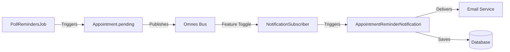

# Hexagonal Notification System (Omnes + Noticed)

This plan implements a "Piling and Publishing" pattern for appointment reminders, following Hexagonal Architecture principles to keep the domain logic separated from the notification infrastructure.

## Proposed Changes

### 1. Domain & Core (The Hexagon)
Logic that is independent of external systems (like emails or jobs).

#### [NEW] [appointment.rb](file:///Users/apple/railsdevs.com/app/models/appointment.rb)
The core entity.
```ruby
class Appointment < ApplicationRecord
  # publisher (e.g., therapist) and subscriber (e.g., client)
  belongs_to :publisher, class_name: "User"
  belongs_to :subscriber, class_name: "User"

  scope :pending, -> { where(status: :pending) }
end
```

#### [NEW] [reminder_required_event.rb](file:///Users/apple/railsdevs.com/app/events/appointments/reminder_required_event.rb)
The domain event published when a reminder is needed.
```ruby
module Appointments
  class ReminderRequiredEvent
    include Omnes::Event

    attr_reader :appointment

    def initialize(appointment:)
      @appointment = appointment
    end
  end
end
```

### 2. Messaging Layer (Omnes)
The Bus that coordinates events.

#### [NEW] [omnes.rb](file:///Users/apple/railsdevs.com/config/initializers/omnes.rb)
Initializes the system-wide event bus and registers subscribers.
```ruby
Omnes.config.bus = Omnes::Bus.new
# Register Subscribers
Appointments::NotificationSubscriber.new.subscribe_to(Omnes.config.bus)
```

#### [NEW] [notification_subscriber.rb](file:///Users/apple/railsdevs.com/app/subscribers/appointments/notification_subscriber.rb)
The **Outbound Adapter** that listens to domain events and triggers the notification system.
```ruby
module Appointments
  class NotificationSubscriber
    include Omnes::Subscriber

    handle :reminder_required, with: :send_notifications

    def send_notifications(event)
      appointment = event.appointment
      recipients = [appointment.publisher, appointment.subscriber]
      
      AppointmentReminderNotification.with(appointment: appointment).deliver_later(recipients)
    end
  end
end
```

### 3. Notification Layer (Noticed)
Borrowing the existing pattern from `railsdevs.com`.

#### [NEW] [appointment_reminder_notification.rb](file:///Users/apple/railsdevs.com/app/notifications/appointment_reminder_notification.rb)
```ruby
class AppointmentReminderNotification < ApplicationNotification
  deliver_by :database
  deliver_by :email, mailer: "AppointmentMailer", method: :reminder

  param :appointment

  def appointment
    params[:appointment]
  end

  def title
    "Reminder for your upcoming appointment"
  end

  def url
    appointment_url(appointment)
  end
end
```

### 4. Infrastructure (The Adapters)
Components that interact with the outside world (Time/OS/External APIs).

#### [NEW] [poll_reminders_job.rb](file:///Users/apple/railsdevs.com/app/jobs/appointments/poll_reminders_job.rb)
The **Inbound Adapter** that triggers the hexagon every 5 minutes.
```ruby
module Appointments
  class PollRemindersJob < ApplicationJob
    queue_as :default

    def perform
      Appointment.pending.find_each do |appointment|
        # Publish the event to the bus
        Omnes.config.bus.publish(:reminder_required, appointment: appointment)
      end
    end
  end
end
```

### 5. Transitioning `save_and_notify`
To answer your question: "How can we call `save_and_notify` from models class?", here is how the pattern evolves:

#### Traditional Pattern (Current RailsDevs)
The model is **tightly coupled** to the notification class.
```ruby
# app/models/concerns/messages/notifications.rb
def save_and_notify
  if save
    # The model "knows" exactly which notification to send
    NewMessageNotification.with(message: self).deliver_later(recipient.user)
  end
end
```

#### Hexagonal Pattern (Refactored)
The model is **decoupled**. It only knows that a "Domain Event" happened.
```ruby
# app/models/appointment.rb
def save_and_notify
  if save
    # The model just announces the event to the bus
    Omnes.config.bus.publish(:appointment_created, appointment: self)
    true
  end
end
```

### 6. Feature Toggle
To "ship but hide" this feature, we implement a simple boolean check at the entry points.

#### [MODIFY] [application.rb](file:///Users/apple/railsdevs.com/config/application.rb)
Add a global configuration for the feature.
```ruby
config.appointments_notifications_enabled = ENV.fetch("APPOINTMENTS_NOTIFICATIONS_ENABLED", "false") == "true"
```

#### [MODIFY] [omnes.rb](file:///Users/apple/railsdevs.com/config/initializers/omnes.rb)
Only register the subscriber if the feature is enabled.
```ruby
Omnes.config.bus = Omnes::Bus.new

if Rails.configuration.appointments_notifications_enabled
  Appointments::NotificationSubscriber.new.subscribe_to(Omnes.config.bus)
end
```

#### [MODIFY] [View/Controller Logic]
In any view or controller where you want to hide the logic:
```erb
<% if Rails.configuration.appointments_notifications_enabled %>
  <%= render "appointments/notification_settings" %>
<% end %>
```

### 7. TDD & Testing Strategy
Following hexagonal principles, we test each boundary independently.

#### A. The Core (Model & Events)
Verify that the model publishes the correct event.
```ruby
# test/models/appointment_test.rb
test "save_and_notify publishes a reminder_required event" do
  appointment = appointments(:one)
  assert_publishes(Omnes.config.bus, Appointments::ReminderRequiredEvent) do
    appointment.save_and_notify
  end
end
```

#### B. The Messaging (Subscriber)
Verify that the subscriber triggers the notification system when an event is received.
```ruby
# test/subscribers/appointments/notification_subscriber_test.rb
test "triggers AppointmentReminderNotification when event is received" do
  appointment = appointments(:one)
  event = Appointments::ReminderRequiredEvent.new(appointment: appointment)
  
  assert_enqueued_email_with AppointmentMailer, :reminder do
    Appointments::NotificationSubscriber.new.call(event)
  end
end
```

#### C. The Inbound Adapter (Job)
Verify that the job finds pending appointments and publishes events.
```ruby
# test/jobs/appointments/poll_reminders_job_test.rb
test "publishes events for pending appointments" do
  pending_appointment = appointments(:pending)
  assert_publishes(Omnes.config.bus, Appointments::ReminderRequiredEvent) do
    Appointments::PollRemindersJob.perform_now
  end
end
```

#### D. The Feature Toggle
Verify that the system respects the toggle.
```ruby
# test/initializers/omnes_test.rb
test "does not register subscriber when feature is disabled" do
  with_feature_disabled(:appointments_notifications) do
    # Clear and re-init bus
    assert_not Omnes.config.bus.registered?(Appointments::NotificationSubscriber)
  end
end
```

---

## Architecture Flow



## Comparisons: Is it better?

| Feature | Traditional Pattern | Hexagonal Pattern |
| :--- | :--- | :--- |
| **Coupling** | High (Model knows about Notifications) | Low (Model knows about Events) |
| **Extensibility** | Hard (Must edit model to add Slack, etc.) | Easy (Just add a new handler to Subscriber) |
| **Testing** | Hard (Must mock mailers) | Easy (Check if event was published) |
| **Feature Toggling** | Hard (Check logic in many places) | **Easy** (Single check in initializer) |

### Verdict
The Hexagonal pattern makes the **Feature Toggle** extremely clean. By simply not registering the subscriber in the initializer, the entire notification subsystem is "killed" without having to put `if` statements inside your `Appointment` model or your `Job`.

## User Review Required

> [!IMPORTANT]
> This requires adding `gem "omnes"` to your `Gemfile`.
> To run the job every 5 minutes, you will need to add a recurring job handler like `sidekiq-scheduler` or use a standard cron job that calls `Appointments::PollRemindersJob.perform_later`.

> [!TIP]
> This pattern allows you to add *other* subscribers later (e.g., Slack notifications, SMS) without ever changing the `PollRemindersJob` or the `Appointment` model.
